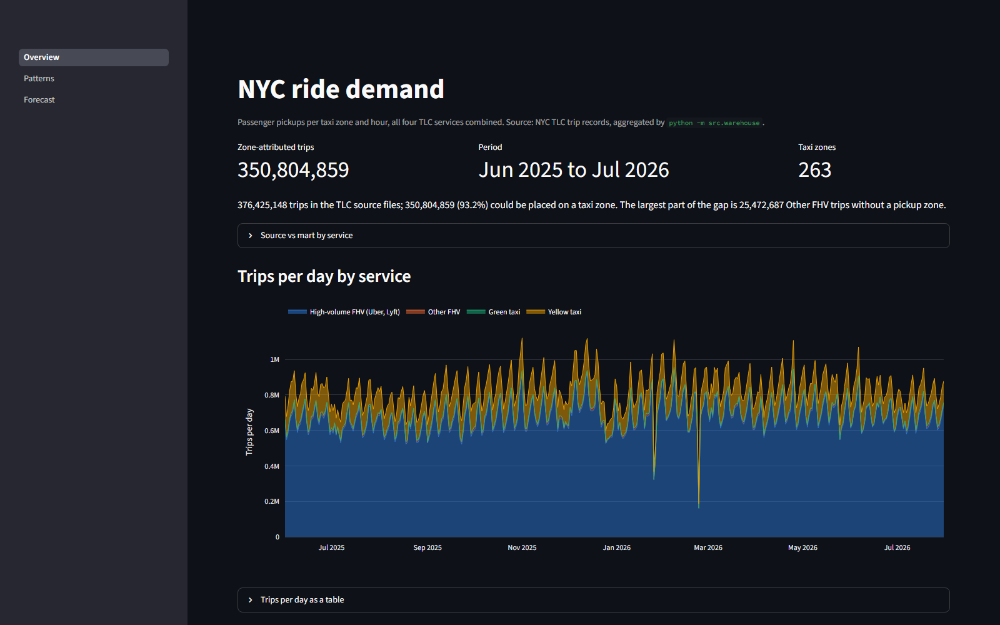
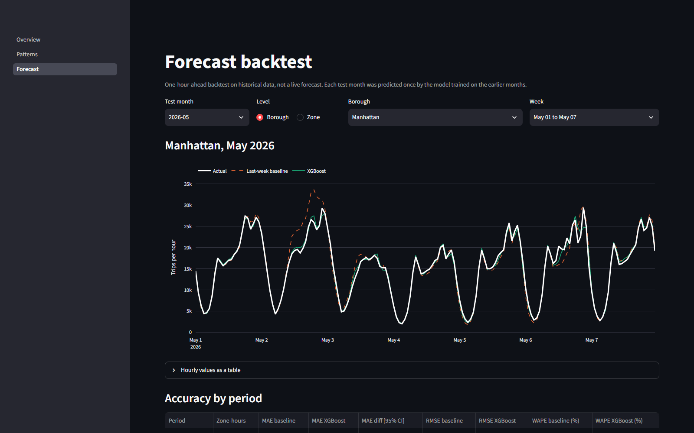
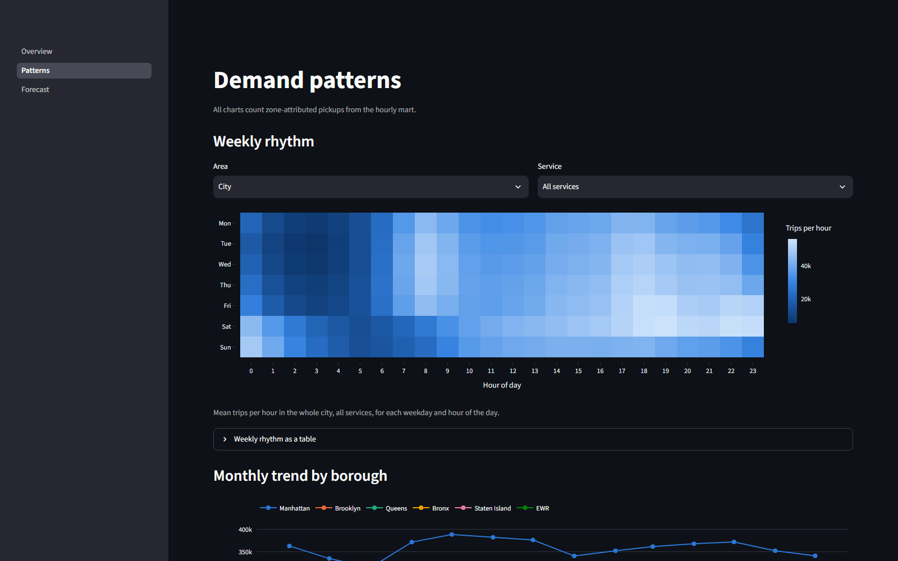
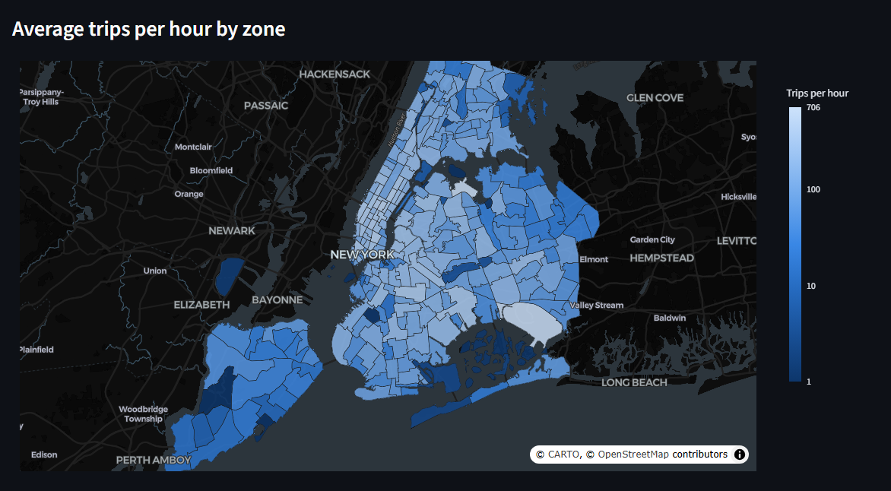
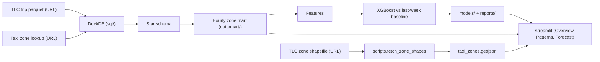
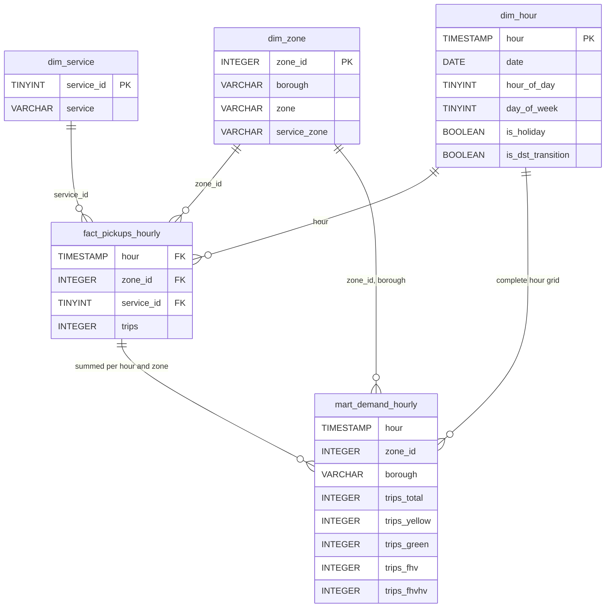

# NYC Taxi Demand Forecasting

In the next hour, how many passenger rides will start in each neighbourhood of New York City?

## Live demo

TODO: link



## Problem → Approach → Results

- **Problem.** A fleet dispatcher or a transport agency wants to know, one hour ahead, how many rides (yellow taxi, green taxi, FHV and high-volume FHV such as Uber and Lyft) will be picked up in each of the 263 NYC taxi zones.
- **Data.** 376,425,148 public NYC TLC trip records from June 2025 to July 2026 are read straight from the TLC URLs; 350,804,859 of them have a usable pickup hour and zone.
- **Approach.** DuckDB aggregates the four services into a star schema and an hourly zone mart (2,688,912 zone-hours, committed to this repository). One global XGBoost model predicts the next hour from lagged demand and calendar features.
- **Baseline.** The same zone at the same hour one week earlier.
- **Evaluation.** Train on June 2025 to March 2026, select the model on April 2026, then predict May, June and July 2026 once each.
- **Results.** On the three test months XGBoost lowers MAE by 39.8% to 40.9% compared with the baseline (for example 22.44 → 13.25 trips per zone-hour in July), with a WAPE of 9.6% to 10.4% against 16.1% to 17.6% for the baseline.

## Results



### Forecast accuracy

Produced by `python -m src.train` → [`models/metrics.json`](models/metrics.json).

| Period | Zone-hours | MAE baseline | MAE XGBoost | MAE difference [95% CI] | WAPE baseline | WAPE XGBoost |
| --- | --- | --- | --- | --- | --- | --- |
| Validation, 2026-04 | 189,360 | 19.07 | 12.52 | −6.55 [−7.51, −5.62] | 14.3% | 9.4% |
| Test, 2026-05 | 195,672 | 21.94 | 13.00 | −8.94 [−11.19, −6.89] | 16.1% | 9.6% |
| Test, 2026-06 | 189,360 | 22.48 | 13.54 | −8.94 [−10.91, −7.35] | 17.2% | 10.3% |
| Test, 2026-07 | 195,672 | 22.44 | 13.25 | −9.18 [−11.23, −7.31] | 17.6% | 10.4% |

MAE is in trips per zone and hour. WAPE is the sum of absolute errors divided by the sum of actual trips. The confidence interval comes from a paired block bootstrap over days (1000 resamples, seed 42). Validation was used to select the model, so its row is optimistic.

### Accuracy by borough

Produced by `python -m src.train` → [`reports/metrics_by_borough.csv`](reports/metrics_by_borough.csv). Each cell is MAE baseline → MAE XGBoost.

| Borough | Zones | Test 2026-05 | Test 2026-06 | Test 2026-07 |
| --- | --- | --- | --- | --- |
| Manhattan | 69 | 37.02 → 19.58 | 35.30 → 19.98 | 37.21 → 19.70 |
| Brooklyn | 61 | 21.59 → 13.21 | 22.61 → 13.75 | 21.58 → 13.26 |
| Queens | 69 | 17.30 → 11.35 | 19.33 → 12.41 | 19.02 → 12.06 |
| Bronx | 43 | 13.88 → 9.24 | 15.07 → 9.39 | 13.60 → 9.24 |
| Staten Island | 20 | 5.36 → 4.04 | 5.76 → 4.15 | 5.92 → 4.36 |
| EWR | 1 | 1.18 → 1.04 | 1.29 → 1.11 | 1.36 → 1.12 |

### Data quality

Produced by `python -m src.warehouse` → [`reports/data_quality.json`](reports/data_quality.json), which holds the same counts per service and month.

| Service | Rows read | Pickup outside the month | No pickup zone | Zone 264/265 (unknown, outside NYC) | Rows in mart | Kept |
| --- | --- | --- | --- | --- | --- | --- |
| yellow | 55,328,817 | 228 | 0 | 99,460 | 55,229,129 | 99.820% |
| green | 633,785 | 237 | 0 | 2,080 | 631,468 | 99.634% |
| fhv | 30,306,813 | 0 | 25,472,687 | 31,385 | 4,802,741 | 15.847% |
| fhvhv | 290,155,733 | 0 | 0 | 14,212 | 290,141,521 | 99.995% |
| All | 376,425,148 | 465 | 25,472,687 | 147,137 | 350,804,859 | 93.194% |

## The app





The app reads only the files committed to this repository: it needs no database and no model, and the tests run without a network connection (the map background tiles are loaded by the browser).

## How it works



The warehouse is a star schema in a local DuckDB file; the mart is derived from it and is the only part committed to the repository. The keys below are logical: the tables declare no constraints.



Data sources:

- Trip records: the public NYC TLC parquet files, `https://d37ci6vzurychx.cloudfront.net/trip-data/{service}_tripdata_{YYYY-MM}.parquet`.
- Zone names: `https://d37ci6vzurychx.cloudfront.net/misc/taxi_zone_lookup.csv`.
- Zone boundaries for the maps: the TLC taxi zone shapefile, `https://d37ci6vzurychx.cloudfront.net/misc/taxi_zones.zip`, converted once to WGS84 GeoJSON with pyshp and pyproj by [`scripts/fetch_zone_shapes.py`](scripts/fetch_zone_shapes.py) (`requirements-geo.txt`; not needed to run the app or the tests).

The Streamlit app has three pages:

- **Overview**: totals, how the mart reconciles with the source files, trips per day by service and a map of average trips per hour by zone.
- **Patterns**: weekday by hour heatmap, monthly trend and service mix by borough, unusual days and a per-zone explorer.
- **Forecast**: backtest of XGBoost against the baseline for a chosen week, accuracy tables, error by hour of day, a zone map (the forecast for one chosen hour, or the error over the month) and the largest misses.

Tech stack:

1. **DuckDB** (SQL in [`sql/`](sql/)) reads two columns of each parquet file over HTTP and builds the star schema and the mart.
2. **pandas / pyarrow** for features and evaluation.
3. **XGBoost** for the single global model.
4. **Streamlit + Plotly** for the three-page app.
5. **GitHub Actions** runs the tests and can rebuild one month to compare it with the committed mart.

Power BI connection guide: [`docs/powerbi.md`](docs/powerbi.md).

## How to run

```bash
pip install -r requirements.txt                    # Python 3.13
python -m src.warehouse --months 2025-06:2026-07   # optional: the mart is already committed
python -m src.train                                # optional: metrics and model are already committed
streamlit run app.py
```

Tests: `pip install -r requirements-dev.txt`, then `pytest -q` (no network needed).

### Adding a new month

Set `months.end` in [`config/pipeline.yaml`](config/pipeline.yaml) to the new month and run `python -m src.warehouse --months YYYY-MM`; the app reads every partition found in the mart, so the new month appears without any other change. Run `python -m src.train` again only if the evaluation split should change, after updating `split` in the same config file.

## Limitations

- **The mart is not the full TLC volume.** The source files hold 376,425,148 trips; 350,804,859 of them (93.2%) could be placed on a taxi zone and are in the mart. Of the 25,620,289 trips left out, 25,472,687 are FHV trips without a pickup zone (from [`reports/data_quality.json`](reports/data_quality.json)).
- **FHV is mostly missing.** Between 80% and 92% of FHV trips per month have no pickup zone in the source files and cannot be counted, so the "all services" total under-counts this service.
- **Possible double counting was checked on one day only.** Since June 2026 the yellow files carry an undocumented `request_source` column with values such as `HV0003` (Uber's licence number in the HVFHS data dictionary on the [TLC trip record page](https://www.nyc.gov/site/tlc/about/tlc-trip-record-data.page)). On Wednesday 2026-06-10, 7.8% of those yellow trips (2,029 of 26,113) matched an Uber trip in the fhvhv file on zones and times, against 9.6% (10,383 of 108,722) of yellow trips without a `request_source` ([`reports/double_count_check.json`](reports/double_count_check.json)). That is no evidence of double counting, but it is one day and one matching rule, and TLC does not document the column.
- **The tree limit was reached.** The selected model stopped at 599 of at most 600 trees, so it was still improving. The limit was fixed before training and not raised afterwards, because the test months had already been used.
- **Weather did not help and is not used.** Observed temperature and precipitation (a perfect "oracle" forecast) gave a validation MAE of 12.65 against 12.52 without them, so the final model has no weather features.
- **Low-volume zones are poorly predicted in relative terms.** EWR (one zone, about 1.4 trips per hour) has a WAPE of 75% to 81% for XGBoost.
- **Two days are far below normal and are left in the data.** 2026-01-25 reached 45.1% and 2026-02-23 reached 24.3% of the median of the same weekday in the four weeks before and after ([`reports/unusual_days.csv`](reports/unusual_days.csv), from `python -m scripts.unusual_days`). All four services fall on both days. No cause is attributed, and both days are part of the training period.
- **Daylight saving time.** Timestamps are New York wall-clock time: the hour 01:00 on 2025-11-02 holds two real hours and 02:00 on 2026-03-08 is almost empty. Both are left as they are.
- **This is a backtest, not a live forecast.** The model predicts one hour ahead from the actual demand of the previous hours; the app replays stored predictions.
- **The TLC CDN throttles clients.** After about 20 files in a row it answers HTTP 403 for a few minutes; the warehouse build waits and retries.
- **No claim about the FIFA World Cup.** June and July 2026 overlap the tournament and are slightly harder to predict than May, but nothing here shows that the tournament is the cause.
- **A WAPE near 10% is plausible, not a leak.** Zones average about 130 trips per hour, the lag features were recomputed independently in SQL, and removing the short-term lags raises validation WAPE from 9.4% to 11.3% ([`reports/leakage_check.json`](reports/leakage_check.json)).
- An earlier version of this project (BigQuery, LSTM, notebooks) is kept on the branch `archive/before-cleanup`.

## Authors

Course project for Data Warehouse and Decision Support Systems, HCMUT, semester 2, 2026.

- Phan Thanh Tấn ([thanhtan2210](https://github.com/thanhtan2210)): built the project alone and rebuilt it in 2026 (DuckDB warehouse, XGBoost evaluation, Streamlit app).
